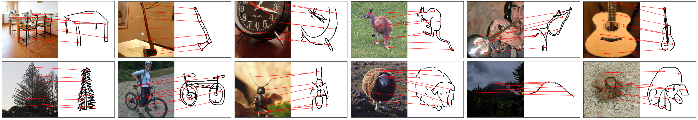

# Learning Dense Correspondences between Photos and Sketches
We introduce a new benchmark and a weakly-supervised method for learning the dense correspondences between photos and sketches. 
This repository is the official PyTorch implementation of our paper: 

[**Learning Dense Correspondences between Photos and Sketches**, *Xuanchen Lu*, *Xiaolong Wang*, *Judith Fan*](https://arxiv.org/abs/2307.12967),
ICML 2023.

<div align="center">

</div>

## Links
* [Project Page](https://photo-sketch-correspondence.github.io/) (with additonal visual results)
* [arXiv Page](https://arxiv.org/abs/2307.12967)

## PSC6K Benchmark
We develop a novel sketch-photo correspondence benchmark, ***PSC6K***, augmenting the *Sketchy dataset* with fine-grained keypoint annotations. 
Our benchmark contains **150,000 annotations** across **6,250 photo-sketch pairs** from **125 object categories**.
Please see [PSC6K Benchmark README](PSC6K_Benchmark_README.md) for detailed instructions for downloading and usage.

<div align="center">

</div>

**PSC6K Benchmark** (keypoint annotations): [Amazon S3](https://photo-sketch-correspondence-6k.s3.amazonaws.com/PSC6K.zip)  
**Sketchy Dataset** (photo-sketch images): [Official Page](sketchy.eye.gatech.edu) | [Google Drive](https://drive.google.com/file/d/1z4--ToTXYb0-2cLuUWPYM5m7ST7Ob3Ck/view)

## Environmental Setup
You can set up the environment following the scripts below.
While the script uses Python 3.9 and PyTorch 1.13, the code might be able to run on earlier versions, such as Python 3.7 and PyTorch 1.8.

```shell
conda create -n psc python=3.9 -y
conda activate psc
conda install pytorch==1.13.0 torchvision==0.14.0 torchaudio==0.13.0 pytorch-cuda=11.6 -c pytorch -c nvidia
conda install pandas matplotlib seaborn
conda install -c conda-forge tqdm scikit-learn
pip install kornia tensorboard opencv-python-headless
```

## Data Preparation
After you download the Sketchy dataset and our PSC6K benchmark following [PSC6K Benchmark README](PSC6K_Benchmark_README.md), 
you can unzip them into an arbitrary directory. 

The expected file structure is as follows:
```shell

PSC6K
├── README.md
├── ...
├── train_pairs_ps.csv
├── test_pairs_ps.csv
├── train_pairs_st.csv
├── test_pairs_st.csv

Sketchy  # We keep the original file structure from the Sketchy dataset
├── rendered_256x256
│   ├── README.txt
│   ├── 256x256
│   │   ├── photo
│   │   │   ├── tx_000100000000
│   │   │   │   ├── ant
│   │   │   │   ├── ape
│   │   │   │   ├── apple
│   │   │   │   ├── ...
│   │   │   │   ├── zebra
│   │   │   ├── ...
│   │   ├── sketch
│   │   │   ├── tx_000100000000
│   │   │   │   ├── ant
│   │   │   │   ├── ape
│   │   │   │   ├── apple
│   │   │   │   ├── ...
│   │   │   │   ├── zebra
│   │   │   ├── ...
```

## Training and Evaluation
### Training Feature Encoder
```shell
# example: training feature encoder with ResNet-18 backbone 
python train_psc.py --data-path path/to/Sketchy --csv-path path/to/PSC6K \
                    --save-dir path/to/weights/saving --log-dir path/to/logging \
                    --resume-pretrained-encoder path/to/imagenet/pretrained/weights \
                    --task encoder --arch resnet18 \
                    --lr 0.03 --knn-freq 5 -j 16
```

The training script will save weights to `path/to/weights/saving`, with the name `resnet18_cbn_encoder_pair_%hyperparameter_%time/checkpoint_%epoch.pth.tar`

### Training Warp Estimator
```shell
# example: training warp estimator with default parameters
python train_psc.py --data-path path/to/Sketchy --csv-path path/to/PSC6K \
                    --save-dir path/to/weights/saving --log-dir path/to/logging \
                    --resume-encoder path/of/model/weights \
                    --task estimator --arch resnet18 \
                    --lr 0.003 --pck-freq 5 \
                    --sim-loss 0.1 --con-loss 1.0 -j 16
```

The training script will save weights to `path/to/weights/saving`, with the name `resnet18_cbn_estimator_pair_%hyperparameter_%time/checkpoint_%epoch.pth.tar`

Please see the argument parser in [train_psc.py](train_psc.py) for more options.

### PCK Evaluation
```shell
# example: evaluating the trained model
python eval.py --data-path path/to/Sketchy --csv-path path/to/PSC6K \
               --arch resnet18 --checkpoint path/of/model/weights
```

## Benchmark Results

|    Model   | PCK @ 0.05 | PCK @ 0.10 |  ImageNet-pretrained Weights |                                        PSCNet Weights                                            |
|:----------:|:----------:|:----------:|:----------------------------:|:------------------------------------------------------------------------------------------------:|
| ResNet-18  |   56.38    |   83.22    | [MoCo weights](https://photo-sketch-correspondence-6k.s3.amazonaws.com/moco_imagenet_resnet18_reformat.pth.tar)                            | [weights](https://photo-sketch-correspondence-6k.s3.amazonaws.com/psc_resnet18.pth.tar) |
| ResNet-101 |   58.00    |   84.93    | [MoCo weights](https://photo-sketch-correspondence-6k.s3.amazonaws.com/moco_imagenet_resnet101_reformat.pth.tar)                               | [weights](https://photo-sketch-correspondence-6k.s3.amazonaws.com/psc_resnet101.pth.tar) |

The "ImageNet-pretrained weights" are trained with [MoCo v2](https://github.com/facebookresearch/moco) on ImageNet-2012.


## Citation

If you find our work useful to your research, please cite:

```latex
@article{lu2023learning,
  author    = {Lu, Xuanchen and Wang, Xiaolong and Fan, Judith E},
  title     = {Learning Dense Correspondences between Photos and Sketches},
  journal   = {International Conference on Machine Learning},
  year      = {2023},
}
```
